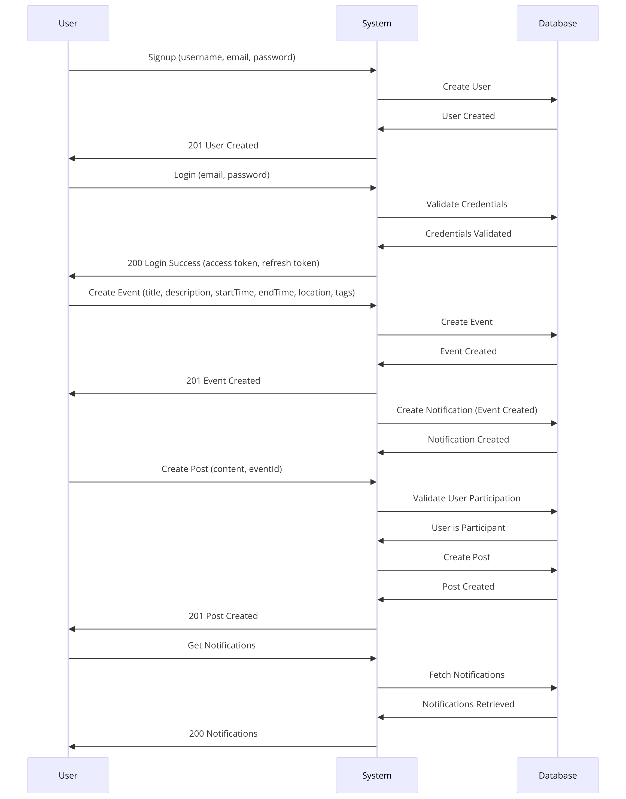

# Event Planner Application

Event Planner is a web application where users can create, join, and post about events. The application supports user authentication, event management, and social interactions such as posting and notifications.

## Table of Contents
1. [App Description](#app-description)
2. [Features](#features)
3. [Tech Stack](#tech-stack)
4. [Database Schema](#database-schema)
5. [Architecture](#architecture)
6. [Setup Instructions](#setup-instructions)
7. [Running the Application](#running-the-application)
8. [API Endpoints](#api-endpoints)

## App Description
Event Planner is designed to facilitate the creation and management of events. Users can sign up, log in, create events, join events, post updates, and receive notifications. The application ensures a seamless interaction between users and the system with real-time updates and notifications.

## Features
- User Authentication: Sign up, log in, and manage user sessions.
- Event Management: Create, update, delete, and view events.
- Event Participation: Join or leave events.
- Posting: Create, update, and delete posts related to events.
- Notifications: Receive notifications about event updates and interactions.

## Tech Stack
- **Frontend:** React (or any frontend framework/library of your choice)
- **Backend:** Node.js, Express.js
- **Database:** MySQL with Prisma ORM
- **Authentication:** JWT (JSON Web Tokens)
- **Containerization:** Docker, Docker Compose

## Database Schema
The database schema includes the following main entities:
- **User:** Manages user information and authentication.
- **Event:** Manages event details and participants.
- **Post:** Manages posts related to events.
- **Notification:** Manages user notifications.
- **Friend:** Manages user friendships.

## Architecture
The architecture includes user interactions with the system for various functionalities such as creating events, posts, and notifications.

## Setup Instructions
### Prerequisites
- Node.js (version 18 or later)
- Docker
- Docker Compose

### Environment Variables
Create a `.env` file in the root directory and add the following environment variables:

### Installation
1. **Clone the repository:**
`cd server`
- Install dependencies:
`npm install`
- Generate Prisma Client:
`npx prisma generate`
- Set up the database:
`npx prisma migrate dev --name init`
- Running the Application
`node app.js`
Access the application:
Open your browser and navigate to http://localhost:3000/docs

### api-endpoints
**Authentication**
- Sign Up: POST /api/auth/signup
- Log In: POST /api/auth/login
- Current User: GET /api/auth/current
- Refresh Token: GET /api/auth/refresh
- Get All Notifications: GET /api/user/notifications

**Events**
- Get All Events: GET /api/event
- Get Event by ID: GET /api/event/:id
- Create Event: POST /api/event
- Update Event: PUT /api/event/:id
- Delete Event: DELETE /api/event/:id
- Participate in Event: POST /api/event/:id/participate
- Get Event Participants: GET /api/event/:id/participants
- Leave Event: POST /api/event/:id/leave

**Posts**
- Create Post: POST /api/post
- Update Post: PUT /api/post/:id
- Delete Post: DELETE /api/post/:id
- Get Event Posts: GET /api/post/event/:eventId

**User**
- Get User by ID: GET /api/user/:id
- Update User: PUT /api/user
- Delete User: DELETE /api/user

**Friends**
- Add Friend: POST /api/user/friends
- Get All Friends: GET /api/user/friends
- Delete Friend: DELETE /api/user/friends
